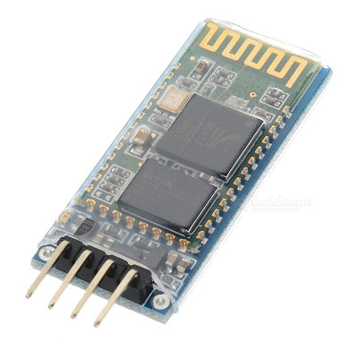
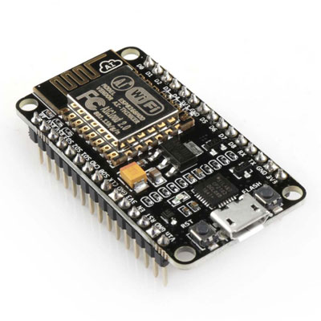
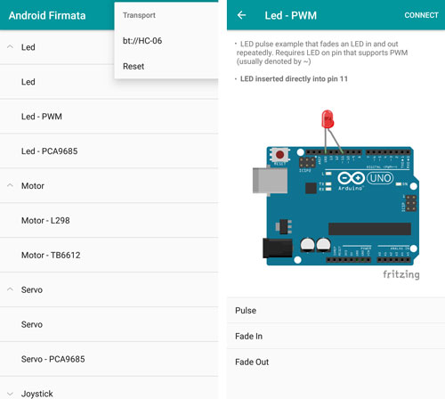

# Android-Firmata

[](https://travis-ci.org/xujiaao/android-firmata)
[](https://bintray.com/xujiaao/android/android-firmata/_latestVersion)
[](README_zh-CN.md)

**IoT Library for Android Developers. Inspired by [Johnny-Five].**

Android-Firmata is a client library of [Firmata] written in **Kotlin**.
It allows controlling Arduino (or other boards, such as [NodeMcu]...)
which runs Firmata Protocol from your Android Application.


## Installation

In your build.gradle:

````
dependencies {
    implementation 'com.xujiaao.android:android-firmata:${android_firmata_version}'
}
````

[](https://bintray.com/xujiaao/android/android-firmata/_latestVersion)


## Get Started

The ubiquitous "Hello World" program of the microcontroller is
"Blink an LED". The following code demonstrates how this is done
using the Android-Firmata Library.

````kotlin
class GetStartedActivity : AppCompatActivity() {

    override fun onCreate(savedInstanceState: Bundle?) {
        super.onCreate(savedInstanceState)

        /**
         * Connect board through Bluetooth transport.
         *
         * NOTICE: Make sure the name of Bluetooth device is "HC-06",
         * and the device has already been bonded with your Android phone!!!
         */
        connectBoardWithLifecycle("bt://HC-06".toTransport(), lifecycle, {
            onConnecting { toast("Connecting...") }

            onConnected { board ->
                toast("Connected")

                val led = board.Led(13) // Create an Led on pin 13
                led.blink(500) // Blink every half second
            }

            onDisconnected { error ->
                if (error != null) {
                    toast("Disconnected: ${error.message}")
                }
            }
        })
    }
}
````


> Note: The image above is copied from [Johnny-Five].


## Guidance

Before programing with the Android-Firmata Library, you need to select
in which way your Android Device and the Arduino Board being connected.

Currently, these communication modes are supported:

- [Connect via Bluetooth](#connect-via-bluetooth)

- [Connect via WiFi](#connect-via-wifi)


### Connect via Bluetooth

#### Requirements

- StandardFirmataPlus v2.5.0 or greater

  - Arduino IDE > Examples > Firmata > StandardFirmataPlus

- A Bluetooth Serial Port Module (such as HC-05, HC-06):

  


#### Setup the Bluetooth Serial Port Module

Since Firmata runs at `57600` baud, you'll need to configure the module
before making a connection with Android-Firmata.

Check out the [Johnny-Five Bluetooth Guide] for more information.


#### Android Programing

Update the [Transport URI](#transports) in your Android Application
to let it know which device should be connected.

For Bluetooth Connection, the URI can be either of:

- `bt:<bluetooth_name>` *(Matches the Bluetooth Name)*

  - **Make sure the Bluetooth device has been bonded before connecting**

- `bt:<bluetooth_mac_address>` *(Matches the Bluetooth Mac Address)*

For example:

````kotlin
/**
 * If the name of your Bluetooth device is "HC-06", then the URI should be:
 *
 *   "bt://HC-06"
 */
connectBoard("bt://HC-06".toTransport(), ...)
````


### Connect via WiFi

#### Requirements

- StandardFirmata**WiFi** v2.5.0 or greater

  - Arduino IDE > Examples > Firmata > StandardFirmata**WiFi**

- A [NodeMcu] (ESP8266) Board

  


#### Setup NodeMcu

Check out the [NodeMcu Guide] to learn about how to install
StandardFirmataWiFi on the board.


#### Android Programing

For WiFi Connection, the [Transport URI](#transports) is:

- `tcp:<board_ip_address>:<board_port>`

For example:

````kotlin
/**
 * If the ip address is '192.168.4.1', and the port is '3030', then the URI should be:
 *
 *   "tcp://192.168.4.1"
 */
connectBoard("tcp://192.168.4.1".toTransport(), ...)
````


## Documentation

### Transports

Android-Firmata Library uses a Transport URI to identify how devices are
being connected:

- Bluetooth:

  - `bt:<bluetooth_name>` *(Matches the Bluetooth Name)*

    - **Make sure the Bluetooth device has been bonded before connecting**

  - `bt:<bluetooth_mac_address>` *(Matches the Bluetooth Mac Address)*

- WiFi:

  - `tcp:<board_ip_address>:<board_port>`


## Sample Application (:link: [Link](https://github.com/xujiaao/android-firmata/releases/latest))

Android-Firmata provides a Sample Application, it shows how to control
peripheral devices with Android-Firmata.



> **Note: Images in the sample application are copied from [Johnny-Five Examples Page].**


### Usage

- [Download](https://github.com/xujiaao/android-firmata/releases/latest) and install the Sample Application on your Android Device.

- Select a smaple

- Follow the breadboard image in the Sample Page for wiring

- Click the "Connect/Disconnect" button in the top right corner to connect your board

- To edit the [Transport URI](#transports), open the "Settings Menu" in the Home Page, select "Transport"


## TODOs

- [ ] Support USB transport
- [ ] Support BLE transport


## License

Android-Firmata is distributed under the terms of the MIT License. See the [LICENSE] file.


[Johnny-Five]: https://github.com/rwaldron/johnny-five
[Johnny-Five Bluetooth Guide]: https://github.com/rwaldron/johnny-five/wiki/Getting-Started-with-Johnny-Five-and-JY-MCU-Bluetooth-Serial-Port-Module
[Johnny-Five Examples Page]: http://johnny-five.io/examples
[Firmata]: https://github.com/firmata/protocol
[NodeMcu]: http://nodemcu.com
[NodeMcu Guide]: https://github.com/xujiaao/android-firmata/wiki/Getting-Started-with-Android-Firmata-and-NodeMcu-Board
[LICENSE]: LICENSE

